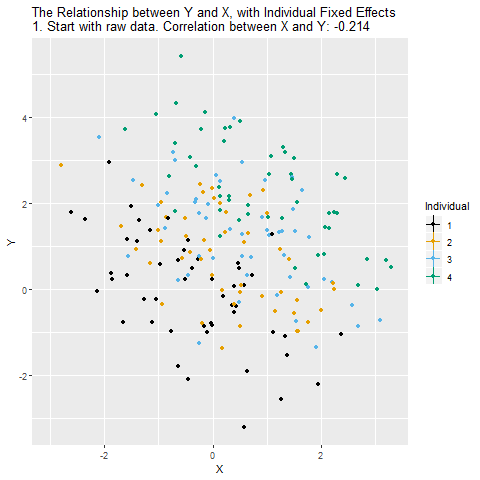

\newcommand{\Cov}{\mathrm{Cov}}
\newcommand{\Var}{\mathrm{Var}}
\newcommand{\tr}{\mathrm{tr}}
\newcommand{\plim}{\operatornamewithlimits{plim}}
\newcommand{\diag}{\mathrm{diag}}
\newcommand{\E}{\mathrm{E}}
\newcommand{\Prob}{\mathrm{Prob}}
\newcommand{\bm}[1]{\boldsymbol{\mathbf{#1}}}

### Required packages

```{r, message = FALSE, warning = FALSE, results = 'hide'}
pkgs <- c("plm", "lfe", "texreg", "tidyr", "dplyr", "lmtest", "sandwich", 
          "ggplot2", "ggforce") 
lapply(pkgs, require, character.only = TRUE)

```

### Session info

```{r}
sessionInfo()

```

# Outline

* Panel data structure

* Decomposing variance

* Fixed Effects estimator

* Random Effects estimator

* Hybrid / Mundlak models

* Statistical inference


# Panel data structure

Usually cross-sectional data is organized as a matrix, where rows represent the obervation / individual and the columns hold the variables. In panel data settings, we need to add the dimension of time. There are two ways to do so:

* Long format: $N \times T$ observations (rows), with variables "id" and "time".

* Wide format: $N$ observations, and $T \times K$ variables, which one variable for each time-period.

Let's have a look at the "Males" data of the `plm` package.

```{r}
data("Males")
head(Males[,1:5], n = 16)
```

This is long format, with `nr` as person identifier (id) and `year` as time indicator. Long format is what we usually need for analysing data.

Sometimes data comes in wide format. Luckily, we can easily switch between those formats using `tidyr`.

```{r}
Males_wide <- pivot_wider(Males, id_cols = nr, names_from = year, 
                          values_from = 3:ncol(Males), names_sep = "_")
head(Males_wide[,1:5], n = 16)
```

And we can go back to long again:

```{r}
Males_long <- pivot_longer(Males_wide, cols = 2:ncol(Males_wide), 
                           names_to = c(".value", "year"), 
                           names_pattern = "(.*)_(.*)")
head(Males_long[,1:5], n = 16)
```

Moreover, there two types of panel data:

* Balanced: Contains information for each unit at each time period

* Unbalanced: Some units have missing information at some time periods

```{r}
is.pbalanced(Males, index = c("nr", "year"))
```
In our example, we have balanced data (although there might still be NAs in the data).

A nice feature of panel data is that we can do some within-person transformation. For instance we can calculate the lags and leads, or first differences of data. NOTE: always make sure the data is sorted properly before you do!

```{r}
# Order data
Males <- Males[order(Males$nr, Males$year),]

# Person specific means
Males$m_wage <- ave(Males$wage,
                    Males$nr,
                    FUN = function(x) mean(x, na.rm = TRUE))

# Lag (last years value)
Males$lag_wage <- ave(Males$wage,
                      Males$nr,
                      FUN = function(x) dplyr::lag(x, n = 1))

# Lead (next years value)
Males$lead_wage <- ave(Males$wage,
                      Males$nr,
                      FUN = function(x) dplyr::lead(x, n = 1))

# First difference (this years value minus last years value)
Males$fd_wage <- ave(Males$wage,
                      Males$nr,
                      FUN = function(x) x - dplyr::lag(x, n = 1))

head(Males[, c("nr", "year", "wage", "m_wage", "lag_wage", "lead_wage", "fd_wage")], n = 16)
```

There are a lot of different panel data sources available. Some examples are:

* [PSID](https://psidonline.isr.umich.edu/)

* [National Longitudinal Survey of Youth](https://www.nlsinfo.org/content/cohorts/nlsy79)

* [Understanding Society](https://www.understandingsociety.ac.uk/)

* [Millennium Cohort Study](https://cls.ucl.ac.uk/cls-studies/millennium-cohort-study/)

* [SOEP](https://www.diw.de/en/diw_01.c.615551.en/research_infrastructure__socio-economic_panel__soep.html)

* [Pairfam](https://www.pairfam.de/)

* [SHARE](http://www.share-project.org/home0.html)

And there are various process generated data having a longitudinal / panel dimension as well. For instance:

* [Our world in data COVID](https://github.com/owid/covid-19-data)

* [UK Census](https://www.nomisweb.co.uk/sources/census)

* [London Air Pollution](https://data.london.gov.uk/air-quality/)

* [European Tree Cover Density](https://land.copernicus.eu/pan-european/high-resolution-layers/forests/tree-cover-density/status-maps)

One thing that is often difficult: Many panel data come as a bunch of single (cross-sectional) files and have to be combined into a single dataset. However, many data providers (or nice colleagues) now offer simplified long-format data or pre-written scripts to merge data across waves (e.g. [here](https://www.understandingsociety.ac.uk/documentation/mainstage/syntax) for Understanding Society, or [here](https://www.ls3.soziologie.uni-muenchen.de/studium-lehre/lehrmaterialien/index.html) for SOEP).


A second problem is panel attrition. Usually, the number of individuals participating repeatedly goes down over time.


The main question here: Is attrition (as good as) random or are drop-outs systematic? How does this affect the sample composition and representativeness?

Most panels also provide inverse-probability of staying weights to account for the possibility of non-random attrition. Note that these also probability weights can only account for attrition based on observables. For a general discussion about weighting see for instance @Solon.2015.

# Decomposing variance

Let's clarify the idea and advantage of panel data with an example. Assume we want to know the relationship between age (as our independent variable) and happiness (as our dependent variable), and we have data on 24 observations.

```{r class.source = 'fold-hide', message = FALSE, warning = FALSE}
################################
### Example 1: Age happiness ###
################################

set.seed(213)

### Data simulation program
simdata <- function(N = 6, T = 4,
                    age_range = c(20:60), 
                    u_sd = 0.2, uw_sd = 0){
  
  # id and wave
  df <- data.frame(matrix(NA, ncol = 2, nrow = N*T))
  names(df) <- c("id", "wave")
  
  df$id <- rep(1:N, each = T)
  df$wave <- rep(1:T, times = N)
  df$idname <- factor(df$id, levels = c(1:N), labels = paste("Person", c(1:N)))
  
  # age
  startingage <- age_range
  startingage <- round(quantile(startingage, probs = seq(0, 1, 1/(N-1))), 0)
  df$age <- unname(rep(startingage, each = T)) + df$wave*2
  
  # cohort 
  df$cohort <- 0
  df$cohort[(N*T/2 + 1):(N*T)] <- 1
  df$cohort <- factor(df$cohort, levels = c(0, 1), 
                      labels = c("Younger cohort", "Older cohort"))
  
  # demeaned age
  df$dm_age <- df$age - ave(df$age, df$id, FUN = function(x) mean(x)) 
  
  # Personal intercept
  df$intercept <- 5 + 0.5 * df$id
  
  # Overall error
  u <- rnorm(N*T, mean = 0, sd = u_sd)
  
  # Additional within error
  uw <- unlist(lapply(1:N, function(x) rnorm(T, mean = 0, sd = uw_sd)))
  
  # Gen happiness
  y <- 1 + 0.05 * df$age - 0.2 * df$dm_age + 2 * as.numeric(df$cohort) + u + uw
  df$happiness <- y
  
  # Gen person means
  df$m_age <- ave(df$age, df$id, FUN = function(x) mean(x)) 
  df$m_happiness <- ave(df$happiness, df$id, FUN = function(x) mean(x)) 
  
  return(df)
}

### Set up six individuals with age and happiness
N <- 6
T <- 4

df <- simdata(N = N, T = T)


# Total line for plot
lm1 <- lm(happiness ~ age, data = df)
lm2 <- lm(happiness ~ age + cohort, data = df)
lm3 <- lm(happiness ~ age + idname, data = df)
lm4 <- lm(m_happiness ~ m_age, data = df)
```


## Cross-sectional setting

In a cross-sectional setting, we could just run a standard linear regression model using Omitted Least Squares (OLS) of the form
$$
y_{i} = \alpha + \beta_1 x_{i} + \upsilon_{i},
$$
where $y_{i}$ is the dependent variable (happiness) and $x_i$ the independent variable of each observation $i \in \{1, \dots, 24\}$. $\beta_1$ is the coefficient of interest, $\alpha$ the overall intercept and $\upsilon_{i}$ the error term.

```{r}
lm1 <- lm(happiness ~ age, data = df)
summary(lm1)
```

This indicates a positive relation between age and happiness. Graphically, this would look like:

```{r class.source = 'fold-hide', message = FALSE, warning = FALSE}
zp1 <- ggplot(df, aes(age, happiness)) +
  geom_point( aes(x = age, y = happiness), size = 2, stroke = 1) +
  geom_smooth(method = 'lm', formula = y ~ x, se = FALSE) +
  ylim(3.3, 9.2) + expand_limits(y = c(0, 0)) + 
  theme_bw() +
  theme(legend.key = element_blank(), legend.title = element_blank(),
        legend.position = c(0.95,0.05), legend.justification = c("right", "bottom"),
        legend.background = element_blank(),
        legend.box.background = element_rect(colour = "black"))
zp1  
```

Obviously, we might suspect some other characteristics to influence our results. For instance, birth cohort might be a potential confounder that affects age and happiness. We can easily add a control for the cohort to account for this possibility. We would then estimate the model  

$$
y_{i} = \alpha + \beta_1 x_{i} + \beta_2 z_{it} + \upsilon_{i},
$$
where $z_i$ is the control variable or confounder (cohort).

```{r}
lm2 <- lm(happiness ~ age + cohort, data = df)
summary(lm2)
```

As a result, the effect of age becomes weaker. Graphically, this would look like:

```{r class.source = 'fold-hide', message = FALSE, warning = FALSE}
zp2 <- ggplot(df, aes(age, happiness)) +
  geom_point(aes(x = age, y = happiness, shape = cohort, colour = cohort), 
              size = 2, stroke = 1) +
  geom_smooth(method = 'lm', formula = y ~ x, se = FALSE, show.legend = FALSE,
              mapping = aes(colour = cohort, linetype = cohort)) +  
  geom_abline(intercept = lm2$coefficients[1] + 0.5 * lm2$coefficients[3], 
                               slope = lm2$coefficients[2], col = "blue") +  
  ylim(3.3, 9.2) + expand_limits(y = c(0, 0)) + 
  theme_bw() +
  theme(legend.key = element_blank(), legend.title = element_blank(),
        legend.position = c(0.95,0.05), legend.justification = c("right", "bottom"),
        legend.background = element_blank(),
        legend.box.background = element_rect(colour = "black"))
zp2  
```

So, what we basically receive here is the (weighted) average effect within each birth cohort. We use only similar observations (in terms of cohort) to estimate our effect of interest - the correlation between age and happiness. If we add any controls, we always decompose the variance which contributes to our estimator, and we eliminate the variance that is attributed to the confounder / control variable.


## Panel data setting

Now, with panel data, we can even go a step further. Assume we would not have observed 24 independent observations, but rather 6 independent individuals (N = 6) at 4 time-points each (T = 4). 

```{r class.source = 'fold-hide', message = FALSE, warning = FALSE}
zp3 <- ggplot(df, aes(age, happiness)) +
  geom_point( aes(x = age, y = happiness, shape = idname, colour = idname), 
              size = 2, stroke = 1) +
  ylim(3.3, 9.2) + expand_limits(y = c(0, 0)) + 
  theme_bw() +
  theme(legend.key = element_blank(), legend.title = element_blank(),
        legend.position = c(0.95,0.05), legend.justification = c("right", "bottom"),
        legend.background = element_blank(),
        legend.box.background = element_rect(colour = "black"))
zp3 
```

We can then decompose the available variance into three different parts:

* Pooled variance

* Between variance

* Within variance


### Pooled estimator

The pooled estimator equals what we have seen in the cross-sectional example: we basically assume that we have 24 independent observations and we ignore the person and time dimension. The Pooled OLS estimator is simply:

$$
y_{it} = \alpha + \beta_{POLS} x_{it} + \upsilon_{it},
$$

And, as above, we use the simple `lm()` command

```{r}
lm1 <- lm(happiness ~ age, data = df)
summary(lm1)
```

which graphically looks like:

```{r class.source = 'fold-hide', message = FALSE, warning = FALSE}
zp3 <- ggplot(df, aes(age, happiness)) +
  geom_point( aes(x = age, y = happiness, shape = idname, colour = idname), 
              size = 2, stroke = 1) +
  geom_smooth(method = 'lm', formula = y ~ x, se = FALSE) +
  ylim(3.3, 9.2) + expand_limits(y = c(0, 0)) + 
  theme_bw() +
  theme(legend.key = element_blank(), legend.title = element_blank(),
        legend.position = c(0.95,0.05), legend.justification = c("right", "bottom"),
        legend.background = element_blank(),
        legend.box.background = element_rect(colour = "black"))
zp3 
```

Interpretation: The higher the age of an observation, the higher their happiness.

### Between estimator

The between estimator only compares different persons and discards the within-person variance. Therefore, we simply run a model that only uses the person-specific means

$$
\bar{y_{i}} = \alpha + \beta_{BTW} \bar{x_{i}} + \bar{\upsilon_{i}},
$$

We can either estimate this by hand:

```{r}
df$m_happiness <- ave(df$happiness, df$id, FUN = mean)
df$m_age <- ave(df$age, df$id, FUN = mean)

lm2 <- lm(m_happiness ~ m_age, data = df)
summary(lm2)
```

or we use the `plm` package to do the job for us

```{r}
btw2 <- plm(happiness ~ age, data = df,
           index = c("id", "wave"),
           effect = "individual", model = "between")
summary(btw2)
```

NOTE the line "observations used in estimation" ! The manual approach with `lm` assumes we have 24 independent observations. This is not true, we only have 6 independent observations, where each is replicated 4 times in the data.

Graphically this result looks like:

```{r class.source = 'fold-hide', message = FALSE, warning = FALSE}
zp4 <- ggplot(df, aes(age, happiness)) +
  geom_point(aes(x = age, y = happiness, shape = idname), 
              size = 2, stroke = 1, colour = alpha("black", .3)) +
  geom_point(aes(x = m_age, y = m_happiness, shape = idname, colour = idname), 
             size = 2, stroke = 1) +
  geom_abline(intercept = lm4$coefficients[1], 
              slope = lm4$coefficients[2], col = "blue") +
  ylim(3.3, 9.2) + expand_limits(y = c(0, 0)) + 
  theme_bw() +
  theme(legend.key = element_blank(), legend.title = element_blank(),
        legend.position = c(0.95,0.05), legend.justification = c("right", "bottom"),
        legend.background = element_blank(),
        legend.box.background = element_rect(colour = "black"))
zp4  
```

Interpretation: The older a person the higher their hapinness (as compared to younger people).

### Within estimator

The within estimator only compares different periods within the same person and discards the between-person variance. We could also say the estimator is solely based on changes over time. To achieve this, we simply give every person their own intercept / add a dummy for each person (similar to the cohort example above).

$$
y_{it} = \alpha_i + \beta_{WI} x_{it} + \epsilon_{it},
$$

Again, we could run this manually

```{r}
lm3 <- lm(happiness ~ age + idname, data = df)
summary(lm3)
```

or we use `plm`:

```{r}
fe1 <- plm(happiness ~ age, data = df,
           index = c("id", "wave"),
           effect = "individual", model = "within")
summary(fe1)
```

Graphically, this would look like:

```{r class.source = 'fold-hide', message = FALSE, warning = FALSE}
zp5 <- ggplot(df, aes(age, happiness)) +
  geom_point( aes(x = age, y = happiness, shape = idname, colour = idname), 
              size = 2, stroke = 1) +
  geom_smooth(method = 'lm', formula = y ~ x, se = FALSE, show.legend = FALSE,
              mapping = aes(colour = idname, linetype = idname)) +
  geom_abline(intercept = lm3$coefficients[1] + 1/N * lm3$coefficients[3]  + 1/N * lm3$coefficients[4] 
              + 1/N * lm3$coefficients[5]  + 1/N * lm3$coefficients[6]  + 1/N * lm3$coefficients[7], 
              slope = lm3$coefficients[2], col = "blue") +
  ylim(3.3, 9.2) + expand_limits(y = c(0, 0)) + 
  theme_bw() +
  theme(legend.key = element_blank(), legend.title = element_blank(),
        legend.position = c(0.95,0.05), legend.justification = c("right", "bottom"),
        legend.background = element_blank(),
        legend.box.background = element_rect(colour = "black"))
zp5
```

Now, we have estimated the effect by only taking observations within each person into account: given the person id, how does age correlate with happiness.

Interpretation: The older a person gets, the lower this person's happiness (as compared to the same persons younger age).

The principle is very similar to including a (binary) control variable. It's just that we include a lot of them to get rid of a lot of (potentially confounded) variance.



### Comparison

```{r}
screenreg(list(lm1, lm2, lm3), digits = 3, 
          custom.model.names = c("POLS", "Between", "Within"))
```

POLS: The older an observation (person-year), the higher its happiness.

Between: The older a person, the higher their happiness.

Within: Increasing age within a person goes along with declining happiness within the same person.

The estimates for $\beta_{POLS}$ and $\beta_{BTW}$ are very similar here. We will see below why.

### This is by the way how the within-person relationship looks with real world data in Germany (SOEP)


# Fixed effects estimator

The estimator we used above to derive the within coefficient is the fixed effects (FE) estimator. This method is very widely used, especially with survey data.

We use a second example here: assume we observe 4 individuals over 6 periods, and we want to estimate the effect of marriage on the wage for males. This is the so called "marriage wage premium" [@Ludwig.2018.0].

```{r class.source = 'fold-hide', message = FALSE, warning = FALSE}
##################################
### Example 2: Marriage Income ###
##################################

### Set up six individuals with age and happiness
N <- 4
T <- 6

# id and wave
df2 <- data.frame(matrix(NA, ncol = 2, nrow = N*T))
names(df2) <- c("id", "wave")

df2$id <- rep(1:N, each = T)
df2$wave <- rep(1:T, times = N)
df2$idname <- factor(df2$id, levels = c(1:N), labels = paste("Person", c(1:N)))

# Marriage dummy
df2$marriage_ever <- 0 
df2$marriage_ever[(N*T/2 + 1):(N*T)] <- 1

df2$marriage <- df2$marriage_ever * ifelse(df2$wave >= 4, 1, 0)

# Starting wage
stw <- c(2000, 5000)
stw <- round(quantile(stw, probs = seq(0, 1, 1/(N-1))), 0)

# wage equation
df2$wage <- unname(rep(stw, each = T)) + (df2$wave - 1)*50 + 200 * ifelse(df2$wave >=4, 1, 0) + df2$marriage * 500

# counterfactual parallel trend
df2$pti <- unname(rep(stw, each = T)) + (df2$wave - 1)*50 
df2$pt <- unname(rep(stw, each = T)) + (df2$wave - 1)*50 + 200 * ifelse(df2$wave >=4, 1, 0) 
df2$pti[df2$marriage_ever == 0 | df2$wave < 3] <- NA
df2$pt[df2$marriage_ever == 0 | df2$wave < 3] <- NA


### Add individual slope / heterogeneous time trends

# wage equation
df2$wage2 <- unname(rep(stw, each = T)) + (df2$wave - 1)*50  + (df2$wave - 1)*150*df2$marriage_ever + 200 * ifelse(df2$wave >=4, 1, 0) + df2$marriage * 500

# parallel trend
df2$pt2 <- unname(rep(stw, each = T)) + (df2$wave - 1)*50 + 200 * ifelse(df2$wave >=4, 1, 0) + 2*150
df2$pt2[df2$marriage_ever == 0 | df2$wave < 3] <- NA

# actual trend
df2$pt2_cr <- unname(rep(stw, each = T)) + (df2$wave - 1)*50 + (df2$wave - 1)*150*df2$marriage_ever + 200 * ifelse(df2$wave >=4, 1, 0)
df2$pt2_cr[df2$marriage_ever == 0 | df2$wave < 3] <- NA

# Marry to factor
df2$marriage <- factor(df2$marriage, levels = c(0, 1), labels = c("not married", "married"))
df2$marriage_ever <- as.factor(df2$marriage_ever)


### Plot 
zp1 <- ggplot(df2, aes(wave, wage)) +
  geom_line(aes(x = wave, y = wage, group = id), lty = "solid", colour = "black", lwd = 1) + 
  geom_point( aes(x = wave, y = wage, shape = marriage, colour = marriage), 
              size = 2, stroke = 2) +
  theme_bw() +
  theme(legend.key = element_blank(), legend.title = element_blank(),
        legend.position = c(0.05,0.95), legend.justification = c("left", "top"),
        legend.background = element_blank(),
        legend.box.background = element_rect(colour = "black"),
        legend.spacing.y = unit(-0.1, "cm"))
zp1 

```

### Pooled OLS (again)

Let's start with the conventional Pooled OLS (POLS) estimator on panel data

$$
y_{it} = \alpha + \beta x_{it} + \upsilon_{it}
$$

The main problem: this model relies on very strong assumptions for consistency, with the most important one being: 

* $\E(\upsilon_{it} | x_{it}) = 0$, or $Cov(x_{it}, \upsilon_{it}) = 0$

The error (including omitted variables) must not be correlated with $x_{it}$. In observational studies, we cannot observe a lot of things and characteristics (unobservables) such as personal views, physical traits, or empathy. However, everything that influences $y_{it}$ but is unobserved ends up in $\upsilon_{it}$. If anything correlates with $x_{it}$, it is endogenous, and $\hat{\beta}_x$ will be biased.  

Take our marriage example. 

```{r}
summary(lm(wage ~ marriage, data = df2))
```

We would estimate a marriage premium of more than 2,000. The true value is 500. The reason: those who marry at some point already had higher wages before they married. Maybe friendly or emphatic people are more likely to mary and also do better in their job.

```{r class.source = 'fold-hide', message = FALSE, warning = FALSE}
### Plot 
zp2 <- ggplot(df2, aes(wave, wage)) +
  geom_line(aes(x = wave, y = wage, group = id), lty = "solid", colour = "black", lwd = 1) + 
  geom_point( aes(x = wave, y = wage, shape = marriage, colour = marriage), 
              size = 2, stroke = 2) +
  geom_mark_hull(expand = 0.01, aes(fill = marriage), show.legend = FALSE, colour = NA) + 
  theme_bw() +
  theme(legend.key = element_blank(), legend.title = element_blank(),
        legend.position = c(0.05,0.95), legend.justification = c("left", "top"),
        legend.background = element_blank(),
        legend.box.background = element_rect(colour = "black"),
        legend.spacing.y = unit(-0.1, "cm"))
zp2
```

### One-way fixed effects

To relax the strong assumption, we can decompose the error into two parts (between and within) if we use panel data: $\upsilon_{it} = \alpha_i + \epsilon_{it}$, where $\alpha_i$ is the time-constant (person-specific or between) part of the error, and $\epsilon_{it}$ is the time-varying (idiosyncratic or within) part of the error. 

We can thus split up our main assumption for consistency:

* $\E(\alpha_{i} | x_{it}) = 0$: No time-constant unobserved heterogeneity

* $\E(\epsilon_{it} | x_{it}) = 0$: No time-varying unobserved heterogeneity

And write the error component model:

$$
y_{it} = \beta x_{it} + \alpha_i + \epsilon_{it}
$$
As we have seen above, we can include person-dummies to estimate the model above. However, this becomes computationally intense if we have thousands of individuals

Thus, we usually use a transformation approach, where we first subtract the between variance by using use the person-specific means:

$$
\bar{y_{i}} = \beta \bar{x_{i}} + \alpha_i + \bar{\epsilon_{i}}
$$

We then subtract this between part from the pooled data:

$$
y_{it} - \bar{y_{i}} = \beta (x_{it}-\bar{x_{i}}) + (\alpha_i - \alpha_i) + (\epsilon_{it}-\bar{\epsilon_{i}})\\
\tilde{y}_{it} = \beta \tilde{x}_{it} + \tilde{\epsilon}_{it}.
$$

This is called the within transformation. For each group (individual, district, firm), we subtract the group-specific mean from the original variable. This eliminates all between-group variance, including the person-specific part of the error term ($\alpha_i$).

The $\hat{\beta}_{FE}$ is then just the OLS estimator on the transformed data:

$$
\hat{\bm \beta} = (\bm X^\intercal\bm X)^{-1}\bm X^\intercal \bm y
$$

__Note: this also means that every time-constant variable is wiped out - we cannot estimate their effects in FE models!__ 

__Note: the FE estimator can only be applied to observations which are at least observed 2 times ($T \geq 2$)!__

The main assumption for consistency now is

* $\E(\epsilon_{it} | x_{it}, \alpha_i) = 0$

Idiosyncratic time-variation in $\epsilon_it$ must be uncorrelated with variation in $x_it$ across all time periods. However, $\E(\alpha_{i} | x_{i})$ can be any function of $x_i$.

* Time-constant unobserved heterogeneity is allowed

* Only time-varying unobserved heterogeneity biases the estimator

We can use the plm package with options `effect = "individual"` and `model = "within"` to estimate one-ways FE models:

```{r}
fe2 <- plm(wage ~ marriage, data = df2,
           index = c("id", "wave"),
           effect = "individual", model = "within")
summary(fe2)
```

Hm, 850 is closer to 500, but still quite far off! Let's see why.

```{r class.source = 'fold-hide', message = FALSE, warning = FALSE}
### Plot 
zp3 <- ggplot(df2, aes(wave, wage)) +
  geom_line(aes(x = wave, y = wage, group = id, alpha = marriage_ever), lty = "solid", colour = "black", lwd = 1) + 
  geom_point( aes(x = wave, y = wage, shape = marriage, colour = marriage, alpha = marriage_ever), 
              size = 2, stroke = 2) +
  geom_line(aes(x = wave, y = pti, group = id, linetype = "dashed"), colour = "blue", lwd = 1) +
  scale_linetype_identity(labels = "Counterfactual", guide = "legend") +
  scale_alpha_manual(values = c(0.5, 1), guide = "none") +
  # geom_mark_hull(data = df2[df2$marriage_ever == 1, ], aes(x = wave, y = wage, fill = marriage),
  #                expand = 0.01, show.legend = FALSE, colour = NA) + 
  theme_bw() +
  theme(legend.key = element_blank(), legend.title = element_blank(),
        legend.position = c(0.05,0.95), legend.justification = c("left", "top"),
        legend.background = element_blank(),
        legend.box.background = element_rect(colour = "black"),
        legend.spacing.y = unit(-0.1, "cm"))
zp3
```

NOTE: A one-ways FE would effectively drop all those observations without within-variance on the independent variables. In our case, we would disregard those who never marry. 

However, they also experienced an increase in wages when the other two married.

### Two-ways FE

To circumvent the problem above, we want to add the never-married as a control group in our estimator. 

__In general, it is always a good idea to control for temporal shocks!__

We can do so by including person fixed effects and time fixed effects:

$$
y_{it} = \beta x_{it} + \alpha_i + \zeta_t + \epsilon_{it},
$$

where $\zeta_t$ are time fixed effects (analogous to $\alpha_i$). In terms of demeaning this would look like:

$$
(y_{it} - \bar{y}_i  - \bar{y}_t + \bar{y}) = \beta (x_{it} - \bar{x}_i - \bar{x}_t + \bar{x}) + (\epsilon_{it} - \bar{\epsilon}_i  - \bar{\epsilon}_t + \bar{\epsilon}).
$$

This removes common time shocks independent of treatment, and takes back in individuals without variation in $x$. We basically add a `control-group' to the estimation.

We can just change the `effect` option in `plm` to "twoways" to achieve this:

```{r, message = FALSE, warning = FALSE}
fe3 <- plm(wage ~ marriage, data = df2,
           index = c("id", "wave"),
           effect = "twoways", model = "within")
summary(fe3)
```

And here we go with our 500 marriage wage premium. What we do graphically is

```{r class.source = 'fold-hide', message = FALSE, warning = FALSE}
### Plot 
zp4 <- ggplot(df2, aes(wave, wage)) +
  geom_line(aes(x = wave, y = wage, group = id), lty = "solid", colour = "black", lwd = 1) + 
  geom_point( aes(x = wave, y = wage, shape = marriage, colour = marriage), 
              size = 2, stroke = 2) +
  geom_line(aes(x = wave, y = pt, group = id, linetype = "dashed"), colour = "blue", lwd = 1) +
  scale_linetype_identity(labels = "Counterfactual", guide = "legend") +
  theme_bw() +
  theme(legend.key = element_blank(), legend.title = element_blank(),
        legend.position = c(0.05,0.95), legend.justification = c("left", "top"),
        legend.background = element_blank(),
        legend.box.background = element_rect(colour = "black"),
        legend.spacing.y = unit(-0.1, "cm"))
zp4
```


### Still a very critical assumption

In the example above, the twoways FE model works very well. However, adding the control group back in comes with another (relatively strong) assumption:

__Parallel trends between "treatment" and "control" units__

Comparing the 3 waves before the treatment above, this assumption here holds. Both - those who marry and those who never marry - have the same time trend in wages before the "treated" marry.

However, consider the following example. We still have a marriage premium of 500.

```{r class.source = 'fold-hide', message = FALSE, warning = FALSE}
zp5 <- ggplot(df2, aes(wave, wage2)) +
  geom_line(aes(x = wave, y = wage2, group = id), lty = "solid", colour = "black", lwd = 1) + 
  geom_point( aes(x = wave, y = wage2, shape = marriage, colour = marriage), 
              size = 2, stroke = 2) +
  # geom_line(aes(x = wave, y = pt2, group = id, linetype = "dashed"), colour = "blue", lwd = 1) +
  # geom_line(aes(x = wave, y = pt2_cr, group = id, linetype = "dashed"), colour = "grey", lwd = 1, show.legend = FALSE, alpha = 0.7) +
  scale_linetype_identity(labels = "Counterfactual", guide = "legend") +
  # scale_alpha_manual(values = c(0.3, 1), guide = "none") +
  # ylim(3.3, 9.2) + expand_limits(y = c(0, 0)) + 
  theme_bw() +
  ylab("wage") +
  theme(legend.key = element_blank(), legend.title = element_blank(),
        legend.position = c(0.05,0.95), legend.justification = c("left", "top"),
        legend.background = element_blank(),
        legend.box.background = element_rect(colour = "black"),
        legend.spacing.y = unit(-0.1, "cm"))
zp5
```

A two-ways FE will now give us:

```{r, message = FALSE, warning = FALSE}
fe3 <- plm(wage2 ~ marriage, data = df2,
           index = c("id", "wave"),
           effect = "twoways", model = "within")
summary(fe3)
```

The problem: the model does not take into account that the treatment group already had a steeper wage trajectory than the control group. The parallel trends assumption fails.

```{r class.source = 'fold-hide', message = FALSE, warning = FALSE}
zp5 <- ggplot(df2, aes(wave, wage2)) +
  geom_line(aes(x = wave, y = wage2, group = id), lty = "solid", colour = "black", lwd = 1) + 
  geom_point( aes(x = wave, y = wage2, shape = marriage, colour = marriage), 
              size = 2, stroke = 2) +
  geom_line(aes(x = wave, y = pt2, group = id, linetype = "dashed"), colour = "blue", lwd = 1) +
  geom_line(aes(x = wave, y = pt2_cr, group = id, linetype = "dashed"), colour = "grey", lwd = 1, show.legend = FALSE, alpha = 0.7) +
  scale_linetype_identity(labels = "Counterfactual", guide = "legend") +
  # scale_alpha_manual(values = c(0.3, 1), guide = "none") +
  # ylim(3.3, 9.2) + expand_limits(y = c(0, 0)) + 
  theme_bw() +
  ylab("wage") +
  theme(legend.key = element_blank(), legend.title = element_blank(),
        legend.position = c(0.05,0.95), legend.justification = c("left", "top"),
        legend.background = element_blank(),
        legend.box.background = element_rect(colour = "black"),
        legend.spacing.y = unit(-0.1, "cm"))
zp5
```

A possible extension to tackle this problem are fixed effects individual slopes (FEIS) estimators. See the second part.


### Difference in Differences

The difference-in-differences (DD) design is a very basic and popular design to identify causal treatment effects in a panel data setting. 

The most basic setting, is a $2\times 2$ DD estimator. It consists of a setting where we have 2 groups: a treatment group ($T$) and control group ($C$). Each group has been observed at 2 time points: before treatment ($pre$) and after treatment ($post$). 

In this setting we can calculate the change in the treatment group:
$$
\E(\Delta y_{T}) = \E(y_{T}^{post}) - \E(y_{T}^{pre}),
$$

and likewise in the control group:
$$
\E(\Delta y_{C}) = \E(y_{C}^{post}) - \E(y_{C}^{pre}).
$$
The simple DD estimator is then the difference between the differences in the treatment group and the differences in the control group:

$$
\hat{\delta}_{DD} = \E(\Delta y_{T}) - \E(\Delta y_{C}) = (\E(y_{T}^{post}) - \E(y_{T}^{pre})) - (\E(y_{C}^{post}) - \E(y_{C}^{pre})).
$$

In our marriage example:

```{r}
df2$marry_post <- 0
df2$marry_post[df2$wave >= 4] <- 1

y_t_post <- mean(df2$wage[df2$marry_post == 1 & df2$marriage_ever == 1])
y_t_pre <- mean(df2$wage[df2$marry_post == 0 & df2$marriage_ever == 1])

y_c_post <- mean(df2$wage[df2$marry_post == 1 & df2$marriage_ever == 0])
y_c_pre <- mean(df2$wage[df2$marry_post == 0 & df2$marriage_ever == 0])

# Diff in Diff
(y_t_post - y_t_pre) - (y_c_post - y_c_pre)

```

In a setting where $T=2$ or in a setting where every observation is treated at the same time, the DD equals the two-ways FE. In general, DD and two-ways DD are often seen as equivalents. However, the situation becomes more complicated when treatment timing varies [@GoodmanBacon.2021].

We can receive the same estimator in a simple regression. Lets assume $D \in {0, 1}$ is a binary indicator of the treatment group and $Post \in {0, 1}$ a binary indicator of pre- or post-treatment period. Then we can get the DD estimator with an interaction between those two two variables:

$$
y_{it} = \alpha + \gamma D_{i} + \lambda Post_{t} + \delta_{DD} (D_{i} \times Post_{t}) + \upsilon_{it}.
$$


The coefficients correspond to:

* $\alpha$: average outcome of control group in pre-treatment period 

* $\gamma$: average difference between treatment and control group in pre-treatment period 

* $\lambda$: average difference between post- pre-treatment period in control group

* $\delta_{DD}$: difference between treatment and control group in difference between post- pre-treatment period 


```{r}
summary(lm(wage ~ marriage_ever*marry_post, data = df2))
```

# Random effects estimator

There is another popular estimation strategy for panel data: the random effects (RE) estimator. The RE estimator is not only popular for panel data but also very commonly used for hierarchical data, where it is usually called a "multilevel model". More precisely, the RE estimator in the panel context equals a "multilevel model with random intercepts".

The RE estimator has two main "advantages" over the FE estimator:

1) It is more efficient if $\E(\alpha_{i} | x_{it}) = 0$: it has lower standard errors 

2) It allows to estimate the effects of time-constant variables

However, it obscures the main advantage of panel data: the relaxation of assumptions for consistency of estimators. The RE estimator needs the same assumptions as POLS for consistency:

* $\E(\alpha_{i} | x_{it}) = 0$: No time-constant unobserved heterogeneity

* $\E(\epsilon_{it} | x_{it}) = 0$: No time-varying unobserved heterogeneity

The RE estimator can be written as:

$$
y_{it} = \alpha + \beta x_{it} + \alpha_i + \vartheta_{it}.
$$

Instead of assuming $\alpha_i$ are fixed effects, we treat them as i.i.d random effects, usually assuming they are normally distributed

We can also write the RE as a quasi-demeaned estimator:

$$
(y_{it} - \lambda\bar{y}_i) = \beta (x_{it} - \lambda\bar{x}_i) + (\epsilon_{it} - \lambda\bar{\epsilon}_i)  
$$
where $\hat{\lambda} = 1 - \sqrt{\frac{\sigma^2_\epsilon}{\sigma^2_\epsilon + T\sigma^2_\alpha}}$, with $\sigma^2_\epsilon$ denoting the residual variance, and $\sigma^2_\alpha$ denoting the variance of the individual effects $\alpha_i$.

The RE (as POLS) is thus a weighted average of between and within estimator. The weights are determined by the residual variance in FE as share of total residual variance:

$$
\beta_{RE} = \omega_{GLS} \beta_{FE} + (1-\omega_{GLS}) \beta_{BE},\\
\omega_{GLS} = \frac{\sigma^2_{\tilde{x}}}{\sigma^2_{\tilde{x}} + \phi^2 (\sigma^2_x-\sigma^2_{\tilde{x}})},\\
\phi = \sqrt{\frac{\hat{\sigma}^2_{FE}}{\hat{\sigma}^2_{BE}}},
$$

It thus follows that:

* $T$ large, $\sigma^2_\alpha$ large, then RE $\rightarrow$ FE

* $\sigma^2_\alpha$ small, then RE $\rightarrow$ POLS

The RE uses all the available information - between and within variance - and weights the two components by its "predictive power". This makes it the most efficient estimator. 

We could, by the way, do the same for the POLS estimator. Here, however, the weights are just determined by the overall and the within variance in the independent variable:
$$
\beta_{POLS} = \omega_{OLS} \beta_{FE} + (1-\omega_{OLS}) \beta_{BE},\\
\omega_{OLS} = \sigma^2_{\tilde{x}} / \sigma^2_x.
$$

Let's estimate the RE for the happiness - age example, again using the `plm` package.

```{r}
re1 <- plm(happiness ~ age, data = df,
           index = c("id", "wave"),
           effect = "individual", model = "random")
summary(re1)

# Save for later
df_orig <- df
```

This indicates that there is barely any relation between age and happiness. This is because the within and the between estimates cancel out each other. 

```{r class.source = 'fold-hide', message = FALSE, warning = FALSE}
N <- 6
T <- 4
### Models
# Total line for plot
lm1 <- lm(happiness ~ age, data = df)
lm2 <- lm(happiness ~ age + cohort, data = df)
lm3 <- lm(happiness ~ age + idname, data = df)
lm4 <- lm(m_happiness ~ m_age, data = df)
re <- plm(happiness ~ age, df, model = "random", effect = "individual")

### Compare POLS, BE, FE, and RE
estimates <- data.frame(matrix(NA, ncol = 3, nrow = 4))
names(estimates) <- c("Model", "Intercept", "slope")
estimates[1,] <- c("POLS",
                   lm1$coefficients[1],
                   lm1$coefficients[2])
estimates[2,] <- c("BE",
                   lm4$coefficients[1], 
                   lm4$coefficients[2])
estimates[3,] <- c("FE",
                   lm3$coefficients[1] + 1/N * lm3$coefficients[3]  + 1/N * lm3$coefficients[4] 
                   + 1/N * lm3$coefficients[5]  + 1/N * lm3$coefficients[6]  + 1/N * lm3$coefficients[7], 
                   lm3$coefficients[2])
estimates[4,] <- c("RE",
                   re$coefficients[1], 
                   re$coefficients[2])
estimates[, -1] <- apply(estimates[, -1], 2, FUN = function(x) as.numeric(x))

newdf <- data.frame(matrix(NA, ncol = 2, nrow = 2))
names(newdf) <- c("x", "y")
newdf$x <- c(min(df$age), max(df$age))
for(i in 1:nrow(estimates)){
  newdf$y <- estimates[i, "Intercept"] + estimates[i, "slope"]*newdf$x
  newdf$Model <- estimates[i, "Model"]
  if(i == 1){
    pred <- newdf
  }else{pred <- rbind(pred, newdf)}
}

estimates$Model <- factor(estimates$Model, levels = c("POLS", "BE", "FE", "RE"))

gg_color_hue <- function(n) {
  hues = seq(15, 375, length = n + 1)
  hcl(h = hues, l = 65, c = 100)[1:n]
}

zp6 <- ggplot(df, aes(age, happiness)) +
  geom_point(aes(x = age, y = happiness, shape = idname),
             colour = rep(gg_color_hue(6), each = T),
              size = 2, stroke = 1, show.legend = FALSE) +
  geom_smooth(method = 'lm', formula = y ~ x, se = FALSE, show.legend = FALSE,
              linetype = "dashed", aes(group = idname), colour = alpha("gray", 1)) +
  geom_abline(data = estimates, lwd = 1.2,
              mapping = aes(intercept = Intercept, slope = slope, 
                            colour = Model, linetype = Model)) +
  geom_point(data = unique(df[, c("m_age", "m_happiness", "idname")]),
             aes(x = m_age, y = m_happiness, shape = idname),
             colour = gg_color_hue(6), alpha = 0.5,
              size = 3, stroke = 2, show.legend = FALSE) +
  scale_linetype_manual(values = c("solid", "twodash", "longdash", "dotdash")) +
  ylim(3.3, 9.2) + expand_limits(y = c(0, 0)) + 
  theme_bw() +
  theme(legend.key = element_blank(), legend.title = element_blank(),
        legend.position = c(0.95,0.05), legend.justification = c("right", "bottom"),
        legend.background = element_blank(),
        legend.box.background = element_rect(colour = "black"),
        plot.title = element_text(hjust = 0.5))
zp6
```

Both - within and between estimator - get a similar weight for the RE estimator in our example. The reason is that we have nearly identical errors / noise in the in the between model and the within model.

However, this obviously can vary strongly across empirical settings. Lets see what happens when we increase T in our example:

```{r class.source = 'fold-hide', message = FALSE, warning = FALSE}
N <- 6
T <- 8

set.seed(123)
df <- simdata(N = N, T = T, uw_sd = 0, age_range = c(20:60))

### Models
# Total line for plot
lm1 <- lm(happiness ~ age, data = df)
lm2 <- lm(happiness ~ age + cohort, data = df)
lm3 <- lm(happiness ~ age + idname, data = df)
lm4 <- lm(m_happiness ~ m_age, data = df)
re <- plm(happiness ~ age, df, model = "random", effect = "individual")

### Compare POLS, BE, FE, and RE
estimates <- data.frame(matrix(NA, ncol = 3, nrow = 4))
names(estimates) <- c("Model", "Intercept", "slope")
estimates[1,] <- c("POLS",
                   lm1$coefficients[1],
                   lm1$coefficients[2])
estimates[2,] <- c("BE",
                   lm4$coefficients[1], 
                   lm4$coefficients[2])
estimates[3,] <- c("FE",
                   lm3$coefficients[1] + 1/N * lm3$coefficients[3]  + 1/N * lm3$coefficients[4] 
                   + 1/N * lm3$coefficients[5]  + 1/N * lm3$coefficients[6]  + 1/N * lm3$coefficients[7], 
                   lm3$coefficients[2])
estimates[4,] <- c("RE",
                   re$coefficients[1], 
                   re$coefficients[2])
estimates[, -1] <- apply(estimates[, -1], 2, FUN = function(x) as.numeric(x))

newdf <- data.frame(matrix(NA, ncol = 2, nrow = 2))
names(newdf) <- c("x", "y")
newdf$x <- c(min(df$age), max(df$age))
for(i in 1:nrow(estimates)){
  newdf$y <- estimates[i, "Intercept"] + estimates[i, "slope"]*newdf$x
  newdf$Model <- estimates[i, "Model"]
  if(i == 1){
    pred <- newdf
  }else{pred <- rbind(pred, newdf)}
}

estimates$Model <- factor(estimates$Model, levels = c("POLS", "BE", "FE", "RE"))

gg_color_hue <- function(n) {
  hues = seq(15, 375, length = n + 1)
  hcl(h = hues, l = 65, c = 100)[1:n]
}

zp7 <- ggplot(df, aes(age, happiness)) +
  geom_point(aes(x = age, y = happiness, shape = idname),
             colour = rep(gg_color_hue(6), each = T),
              size = 2, stroke = 1, show.legend = FALSE) +
  geom_smooth(method = 'lm', formula = y ~ x, se = FALSE, show.legend = FALSE,
              linetype = "dashed", aes(group = idname), colour = alpha("gray", 1)) +
  geom_abline(data = estimates, lwd = 1.2,
              mapping = aes(intercept = Intercept, slope = slope, 
                            colour = Model, linetype = Model)) +
  geom_point(data = unique(df[, c("m_age", "m_happiness", "idname")]),
             aes(x = m_age, y = m_happiness, shape = idname),
             colour = gg_color_hue(6), alpha = 0.5,
              size = 3, stroke = 2, show.legend = FALSE) +
  scale_linetype_manual(values = c("solid", "twodash", "longdash", "dotdash")) +
  ylim(3.3, 9.2) + expand_limits(y = c(0, 0)) + 
  theme_bw() +
  theme(legend.key = element_blank(), legend.title = element_blank(),
        legend.position = c(0.95,0.05), legend.justification = c("right", "bottom"),
        legend.background = element_blank(),
        legend.box.background = element_rect(colour = "black"),
        plot.title = element_text(hjust = 0.5))
zp7
```

The POLS goes very slightly towards the within estimator. This is because we have increased the within variance in age, but there is still much more variance in age between individuals.

The RE goes strongly towards FE. This is because - by increasing T - the between model now makes a larger error: there are more data points far away from the green BE line. The error or the within model, in contrast, remain unchanged. So RE gives more weight to the within estimator.

However, if we increase the noise in the within estimator (bringing the data points further away from each id-specific regression line), RE would move back towards the between estimator:

```{r class.source = 'fold-hide', message = FALSE, warning = FALSE}
N <- 6
T <- 8

set.seed(123)
df <- simdata(N = N, T = T, uw_sd = 0.5, age_range = c(20:60))

### Models
# Total line for plot
lm1 <- lm(happiness ~ age, data = df)
lm2 <- lm(happiness ~ age + cohort, data = df)
lm3 <- lm(happiness ~ age + idname, data = df)
lm4 <- lm(m_happiness ~ m_age, data = df)
re <- plm(happiness ~ age, df, model = "random", effect = "individual")

### Compare POLS, BE, FE, and RE
estimates <- data.frame(matrix(NA, ncol = 3, nrow = 4))
names(estimates) <- c("Model", "Intercept", "slope")
estimates[1,] <- c("POLS",
                   lm1$coefficients[1],
                   lm1$coefficients[2])
estimates[2,] <- c("BE",
                   lm4$coefficients[1], 
                   lm4$coefficients[2])
estimates[3,] <- c("FE",
                   lm3$coefficients[1] + 1/N * lm3$coefficients[3]  + 1/N * lm3$coefficients[4] 
                   + 1/N * lm3$coefficients[5]  + 1/N * lm3$coefficients[6]  + 1/N * lm3$coefficients[7], 
                   lm3$coefficients[2])
estimates[4,] <- c("RE",
                   re$coefficients[1], 
                   re$coefficients[2])
estimates[, -1] <- apply(estimates[, -1], 2, FUN = function(x) as.numeric(x))

newdf <- data.frame(matrix(NA, ncol = 2, nrow = 2))
names(newdf) <- c("x", "y")
newdf$x <- c(min(df$age), max(df$age))
for(i in 1:nrow(estimates)){
  newdf$y <- estimates[i, "Intercept"] + estimates[i, "slope"]*newdf$x
  newdf$Model <- estimates[i, "Model"]
  if(i == 1){
    pred <- newdf
  }else{pred <- rbind(pred, newdf)}
}

estimates$Model <- factor(estimates$Model, levels = c("POLS", "BE", "FE", "RE"))

gg_color_hue <- function(n) {
  hues = seq(15, 375, length = n + 1)
  hcl(h = hues, l = 65, c = 100)[1:n]
}

zp7 <- ggplot(df, aes(age, happiness)) +
  geom_point(aes(x = age, y = happiness, shape = idname),
             colour = rep(gg_color_hue(6), each = T),
              size = 2, stroke = 1, show.legend = FALSE) +
  geom_smooth(method = 'lm', formula = y ~ x, se = FALSE, show.legend = FALSE,
              linetype = "dashed", aes(group = idname), colour = alpha("gray", 1)) +
  geom_abline(data = estimates, lwd = 1.2,
              mapping = aes(intercept = Intercept, slope = slope, 
                            colour = Model, linetype = Model)) +
  geom_point(data = unique(df[, c("m_age", "m_happiness", "idname")]),
             aes(x = m_age, y = m_happiness, shape = idname),
             colour = gg_color_hue(6), alpha = 0.5,
              size = 3, stroke = 2, show.legend = FALSE) +
  scale_linetype_manual(values = c("solid", "twodash", "longdash", "dotdash")) +
  ylim(3.3, 9.2) + expand_limits(y = c(0, 0)) + 
  theme_bw() +
  theme(legend.key = element_blank(), legend.title = element_blank(),
        legend.position = c(0.95,0.05), legend.justification = c("right", "bottom"),
        legend.background = element_blank(),
        legend.box.background = element_rect(colour = "black"),
        plot.title = element_text(hjust = 0.5))
zp7
```

Do you have an idea what happens if we reduce the range of the starting age of the individuals (bringing them closer together)? 

### There are two main problems with the RE estimator:

1) Interpretation: how to interpret an estimator based on a mix of __within__ and __between__ variance?

2) Strong assumptions for consistency of no time-constant unobserved heterogeneity: very likely to be biased in practice

I personally would generally suggest against the use of RE. Rather, ask yourself whether you are interested in a between or a within question and use the theoretically relevant method.

### Hausman test

If one has a strong reason to use the RE, it is at least advisable to perform a specification test. The Hausman test [@Hausman.1978.0] is the most common specification test to test the consistency of the RE estimator.

$$
H = (\hat{\bm \beta}_1 - \hat{\bm \beta}_0)^\intercal (N^{-1} {\bm V}_{\hat{\bm \beta}_1 - \hat{\bm \beta}_0})^{-1} (\hat{\bm \beta}_1 - \hat{\bm \beta}_0),
$$
where $\hat{\bm \beta}_1$ is consistent, and $\hat{\bm \beta}_0$ is efficient, $N^{-1} {\bm V}_{\hat{\bm \beta}_1 - \hat{\bm \beta}_0} = \Var(\hat{\bm \beta}_1 - \hat{\bm \beta}_0)$, and with RE being fully efficient: $\Var(\hat{\bm \beta}_1 - \hat{\bm \beta}_0) = \Var(\hat{\bm \beta}_1) - \Var(\hat{\bm \beta}_0)$.

This basically perform a test of the Null H$_0$: $\hat{\beta}_{FE} = \hat{\beta}_{RE}$, and shows us if the two estimates differ significantly.

__Use FE if Hausman test significant, and H$_0$ rejected.__

Let's check in our example:

```{r}
phtest(fe1, re1)
```

The test is highly significant and thus suggest that we should use the FE rather than the RE.

Obviously, this test is not helpful if both estimates are biased.

# Hybrid models

One of the stated advantages of the RE is that we can also estimate the effect for time-constant variables. However, there is an easy way of combining the benefits of both worlds: we can just estimate the within effects of time-varying variables in a RE model. 

This is often called the correlated random effects (CRE) model [@Chamberlain.1982; @Mundlak.1978.0]. In sociology, the very similar hybrid model [@Allison.2009.128] is more common.

In general, we just add the person specific means as additional covariates, and estimate a random effects model:

$$
y_{it} = \alpha + \beta x_{it} + \gamma \bar{x}_{i} + \xi_{it}  
$$

We split up the individual effect $\alpha_i = \gamma \bar{x}_{i} + \eta_i$, and thus only control partially for time-constant heterogeneity by adding the person-specific means $\bar{x}_{i}$.

__$\hat{\beta}$ gives us the within estimate for $x$__

See our happiness example

```{r}
# Person specific means
df$m_age <- ave(df$age,
                df$id,
                FUN = mean)

cre <- plm(happiness ~ age + m_age, data = df_orig,
           index = c("id", "wave"),
           effect = "individual", model = "random")

screenreg(list(fe1, btw2, re, cre), digits = 3,
          custom.model.names = c("FE", "BTW", "RE", "CRE"))
```

The estimate for $\beta_{CRE}$ equals the within effect. Note that the coefficient for the mean does not equal the between effect. It equals $\hat{\beta}_{BTW} -  \hat{\beta}_{FE}$. This differs from @Allison.2009.128 hybrid model.

For consistency of $\hat{\beta}_x$ we only need $\E(\epsilon_{it} | x_{i}, \bar{x}_{i}) = 0$: equals the FE assumption for variables additionally included as person-specific means. Usually, one would include person-specific means for all time-varying $\bm x$ (except $\mu_t$ in case of a twoways specification). 

Note that the CRE can also be quite helpful in the case of non-linear models. 

# Statistical inference

The standard errors we have seen so far, were conventional standard error, not taking into account the panel structure.

In the case of a simple linear regression of the form $\bm y = \bm X \bm \beta + \bm \upsilon$ with the coefficients calculated by OLS $\hat{\bm \beta} = (\bm X^\intercal\bm X)^{-1}\bm X^\intercal \bm y$, the covariance matrix is usually calculated as:

$$
\Var(\hat{\bm \beta}) = \hat{\sigma}^2(\bm X^\intercal \bm X)^{-1},
$$
where $\hat{\sigma}^2$ is the estimated error variance:

$$
\hat{\sigma}^2 = \frac{1}{N-K}\sum^N_{i=1}(\hat\upsilon_i)^2
$$


However, with panel data, the idiosyncratic errors are probably:

* heteroskedastic: have a non-constant variance

* autocorrelated: error in one period correlate with errors in other periods

__The conventional errors (as reported in `lm()` and `plm()`) are thus likely to be underestimated.__

The easiest solution is to estimate panel-robust standard errors [@Millo.2017; @Wooldridge.2010.384].

There are various ways for correcting heteroskedastic and autocorrelated standard errors. The most common version is based on work by Arellano and White and takes the form:

$$
\Var(\hat{\bm \beta}_{FE}) = (\tilde{\bm X}^\intercal \tilde{\bm X})^{-1} 
(\sum_{i=1}^N \tilde{\bm X}^\intercal_i \hat{\tilde{\bm\epsilon}}_i \hat{\tilde{\bm\epsilon}}_i^\intercal \tilde{\bm X}_i) 
\hat{\sigma}^2(\tilde{\bm X}^\intercal \tilde{\bm X})^{-1},
$$

where $\hat{\tilde{\bm\epsilon}}_i$ is the vector of FE residuals for each person $i$, and $\tilde{\bm X}$ are the transformed data.

to calculate those standard errors, we can use the `sandwich` and `coeftest` packages. For more information on the various types and options in the command see @Millo.2017.

```{r}
summary(fe1)
```

```{r}
# Get variance covariance matrix directly
vcovx <- vcovHC(fe1, cluster = "group", method = "arellano", type = "HC3")

# Get model output with the robust SEs
coeftest(fe1, vcov = function(x) vcovHC(x, method = "arellano", type = "HC3"))
```

In this case the robust SEs are actually smaller!! This is because this stylized example does not include heteroskedasticity or autocorrelation. However, we will see the difference with some real data.

For a timely discussion on clustering standard error, when to cluster, and which variables to cluster on see @Abadie.2022.

__One hint for large data__: `coeftest` and `sandwich` can be slow on large data. It might be more efficient to use the package `lfe` right away. The `felm()` function (to estimate FE models) requires a four part formula of the form `y ~ x1 + x2 | f1 + f2 | (Q|W ~ x3+x4) | clu1 + clu2`, where "x" are ordinary covariates, "f" are the fixed effects, the third part allows to instrument covariates, and "clu" are clusters for robust standard errors:

```{r}
fe1_2 <- felm(happiness ~ age | id | 0 | id,
               data = df, cmethod = 'cgm2')
summary(fe1_2)
```


# References
