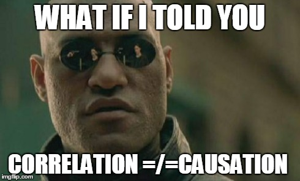
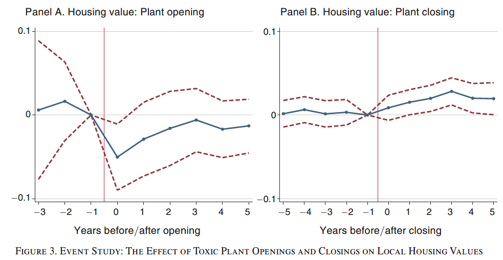
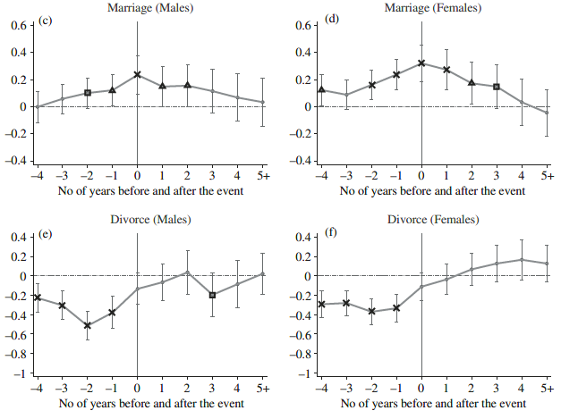
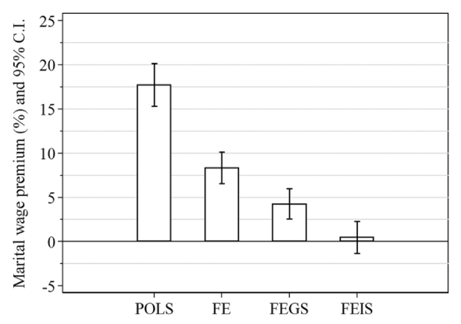
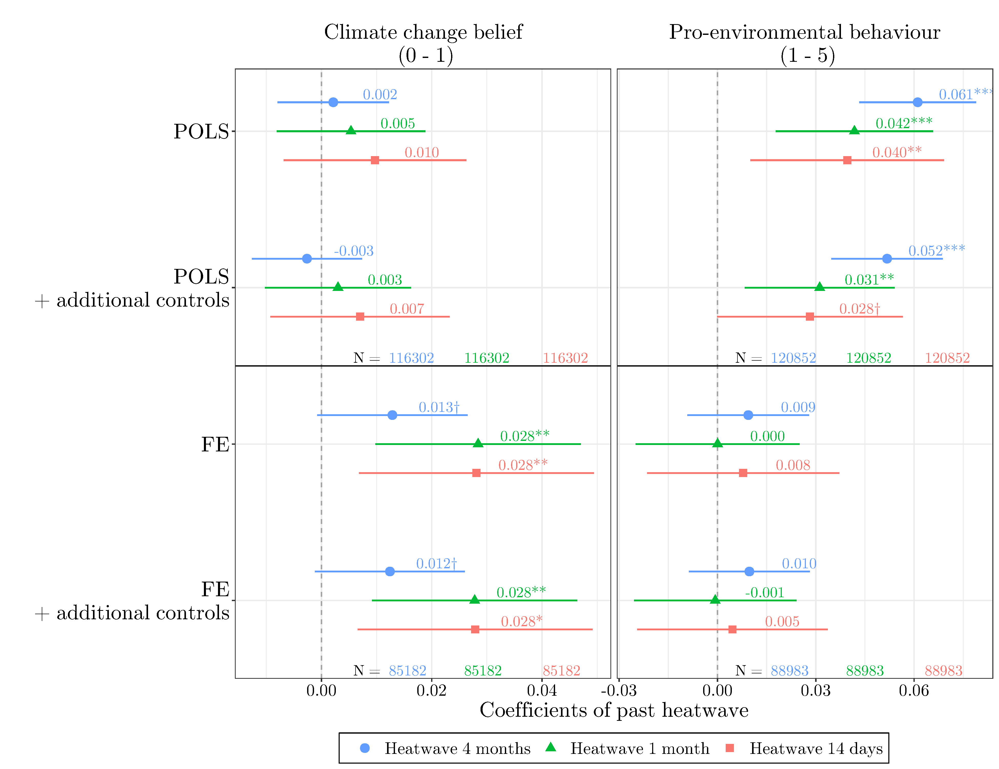

---

[Course Material](https://github.com/ruettenauer/Panel-Data-Analysis)

---

# Introduction

With usual cross-sectional data, we only observe each unit once.

With panel data, we observe the same unit (person, region, or country) repeatedly over time. 

This allows applying statistical methods which identify relations based on the within-unit changes rather than the differences between units. We can then account for some statistical problems of non-experimental studies and increases the confidence in a causal interpretation of the results.

This course provides a hands on introduction to the preparation of panel data and the application of panel data methods. The course focuses on the most common methods like Difference in Differences, Random Effects, and Fixed Effects. We will also briefly discuss some extensions like novel Diff-in-Diff estimators and Fixed Effects Individual Slopes. The empirical part will be based on R and RMarkdown.

This course profited a lot from teaching materials by Josef Brüderl and Volker Ludwig: [Slides](https://www.ls3.soziologie.uni-muenchen.de/studium-lehre/archiv/teaching-marterials/panel-analysis_april-2019.pdf)

### Why do we need panel data analysis? 

In empirical social sciences, we are often interested in the __causal research questions__: we want to investigate questions of cause and effect. Using purely cross-sectional data, we can compare two (or more) different units (e.g. people, states, companies) and test is there exist differences according to our treatment or variable of interest. 

However, these units may not only differ in the dimension of interest, but may also be different in many other other aspects, and it is likely that we do not obverse all the relevant aspects. In the end, we might erroneously conclude that there is a causal effect, even though we only observe correlation (which is confounded by other differences).

Randomized controlled trials (RCT) provide a way to circumvent the problems of unobserved differences between treatment and control cases. 

By randomly selecting some individuals and exposing them to the treatment of interest, we make sure that no (unobserved) characteristics of these individual can be correlated with the treatment. In other words, units in the treatment group should - on average - be identical to units in the control group on all characteristics except the treatment.

However, randomly exposing some individuals to treatment and withholding treatment from others can be tricky in the social sciences. Think about the effects of education, the effects of marriage, or the effect of pregnancy (good luck with your ethics committee).

A potential compromise between those two approaches: "compare alike with alike". This is what we usually aim for by using panel data. We do not compare two different units to each other. Rather, we compare a unit in an earlier stage to the same unit in a later stage. Not as save as an RCT, but much more ethical for many research questions.

# Some examples

### Pant openings and housing prices [@Currie.2015]

### Life course events and happiness [@Clark.2013]

### "Male marital wage premium" [@Ludwig.2018.0]

### Extreme Weather Events Elevate Climate Change Belief but not Pro-Environmental Behaviour [@Ruttenauer.2021c]

# Further materials

Extensive slides by Josef Brüderl and Volker Ludwig: [Slides](https://www.ls3.soziologie.uni-muenchen.de/studium-lehre/archiv/teaching-marterials/panel-analysis_april-2019.pdf)

See also @Bruderl.2015.387.

Books:

* Intuitive: @Allison.2009.128

* Comprehensive and formal: @Wooldridge.2010.384

* For R experts: @Croissant.2019

* General introductions to causal estimation techniques: @Angrist.2015.0, @Cunningham.2021, @Firebaugh.2008

# References
